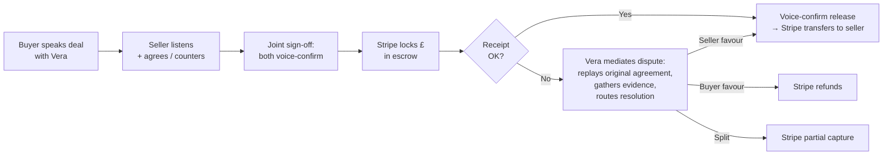

# Vouch

> **Voice-recorded escrow for freelancers and high-value peer-to-peer sales.**
>
> Vera, the AI mediator, handles the agreement. Stripe holds the money. Voice-recorded contracts mean disputes resolve in minutes, not weeks. 5% per deal.

[](https://nextjs.org)
[](https://elevenlabs.io)
[](https://stripe.com)
[](LICENSE)

Submitted to [ElevenHacks 2026 Hack #9: Stripe](https://hacks.elevenlabs.io/hackathons/8) (15–21 May 2026).

**Try it:** [vouch.app/demo](https://vouch.app/demo) (3-min interactive walkthrough, no signup) · [vouch.app](https://vouch.app) (live product, requires Stripe test card)

---

## What Vouch is

Selling something valuable to a stranger on Facebook Marketplace? Hiring a freelancer who might ghost on the invoice? Vouch holds the money in escrow with Stripe, and Vera — our AI mediator — handles the voice agreement on both sides. Every commitment is recorded. Every release is voice-confirmed. **Disputes resolve fast because the contract IS the recording, not a screenshot of a Messenger chat.**

That last point is the whole pitch. Existing P2P platforms have disputes that take weeks because the "evidence" is "he said / she said" over text. Vouch's evidence is the seller's own voice committing to specific terms. When something arrives broken, Vera replays the original commitment, gathers both parties' versions, and routes the money accordingly.

### Two ICPs

- **High-value P2P sellers** — phones, watches, used MacBooks, designer goods. Anyone who's been burned by "Venmo and pray."
- **Freelancers** — designers, developers, copywriters who've delivered work and been ghosted on the invoice. Vouch holds the client's payment before the work ships.

---

## How it works



The state machine is enforced server-side. Every transition (`DRAFT → AWAITING_SELLER → AGREED → IN_ESCROW → RELEASED`) is guarded against out-of-order calls. Disputed deals freeze the money until resolution.

---

## Why we built it the way we did

### Multi-API depth — ElevenLabs (5 APIs, all structurally required)

| API | Role |
|---|---|
| **ConvAI** | Vera live as the mediator — sequential sessions for buyer onboarding, seller onboarding, joint sign-off, voice receipt, and dispute |
| **Voice Design** | Vera's locked voice — a single brand identity across product + demo video |
| **TTS** | Pre-rendered contract recitations (read-back, replay-agreement) — uses different voice settings preset for "contract voice" |
| **Scribe** | Transcript-as-contract — what the buyer said becomes the literal terms object |
| **Multilingual TTS** (`eleven_v3`) | Cross-border deals — UK seller, Polish buyer, Vera translates in real time |

None of these are decorative. Each one corresponds to a structural part of the product. Remove any and a flow breaks.

### Multi-primitive depth — Stripe (5 primitives, all structurally required)

| Primitive | Role |
|---|---|
| **Connect Express** | Custodial escrow — Vouch is the platform, sellers are the connected accounts. Buyer pays platform → platform holds → platform transfers to seller on release |
| **Identity** | Hosted KYC + selfie verification for both parties before money is locked |
| **PaymentIntents (manual capture)** | The escrow mechanic itself — authorize the buyer's card, hold the amount, capture (release) or cancel (refund) on resolution |
| **Application fees** | The 5% platform fee, collected at capture time |
| **Webhooks** | Signature-verified event handling for the entire lifecycle (`payment_intent.*`, `identity.verification_session.*`, `charge.dispute.*`, `account.updated`, `transfer.*`) |

### Hybrid aesthetic — Stripe × A24 (marketing) + Mercury × Linear (app)

Two surface modes, one identity. Marketing pages are full-bleed black with oversized italic serif and Stripe purple CTA. App pages are cream paper, Mercury indigo accent, Linear-density tables, tabular numerals on every money figure.

Full spec: [`docs/DESIGN.md`](docs/DESIGN.md). HTML mockups: [`docs/reference-html-mockups/`](docs/reference-html-mockups/).

---

## Architecture

```
app/
  page.tsx                       # Marketing landing (Stripe × A24)
  layout.tsx, globals.css        # Design tokens from docs/DESIGN.md
  onboard/                       # Day 1 harness: Stripe Connect + Identity onboarding
  new/                           # Buyer voice intake (5 questions → typed terms)
  demo/                          # Interactive 3-min walkthrough (no signup, no real Stripe)
  deals/                         # Dashboard — list view
  deal/[ref]/                    # Detail + timeline + status-aware action panel
    seller/                      # Seller invitation flow
    signoff/                     # Joint sign-off → lock escrow → confirm receipt
    dispute/                     # Dispute intake + replay + evidence
  api/
    deals/                       # Deal CRUD (GET gated by OWNER_TOKEN in prod)
    connect/                     # Stripe Connect Express + onboarding links
    identity/                    # Stripe Identity verification sessions
    escrow/                      # PaymentIntent create / capture / cancel
                                 # (all guarded: deal_id + PI ownership + status check)
    stripe/webhook/              # Signature-verified Stripe webhook
    vera/                        # 12 ConvAI tool endpoints — see docs/vera-tools.json
components/
  Waveform.tsx, VeraIndicator.tsx, AmbientAudio.tsx, CommandBar.tsx
  ui/                            # Shared design primitives (Card, StatusPill, Eyebrow, MoneyAmount)
lib/
  stripe.ts                      # Connect / Identity / escrow helpers + sanitizeStripeError
  elevenlabs.ts                  # ConvAI + TTS + Scribe + Voice Design wrappers
  deals.ts                       # Deal store (in-memory now, Vercel KV swap-in ready)
  vera-contract.ts               # Pure-string composers for Vera recitations
  vera-extract.ts                # Naive regex utterance parser (LLM swap-in pending)
  utils.ts                       # cn(), formatMoney(), dealReference()
types/
  deal.ts                        # Zod schemas: Currency, Deal, Party, Terms, Dispute
  vera.ts                        # Zod schemas for all 12 Vera tool I/O shapes
docs/
  DESIGN.md                      # Design system spec — source of truth
  VERA-SYSTEM-PROMPT.md          # ConvAI agent configuration
  vera-tools.json                # 12 ConvAI tool descriptors (paste into elevenlabs.io)
  reference-html-mockups/        # Original handcrafted mockups
```

---

## Security posture

Vouch handles money movement, PII, identity documents, and (Day 3+) voice biometric data. Every locked review seam ran **forensic + security review in parallel.** Findings + remediations are logged in the [project's off-plan log](https://github.com/cheung-scott/vouch/tree/main/docs).

| Pass | Findings | Status |
|---|---|---|
| T1 forensic — Day 1 Stripe layer | 1 BLOCKER + 3 IMPORTANT + 2 NIT | All fixed |
| T1 forensic — Day 2 voice flow | 2 BLOCKER + 4 IMPORTANT + 2 NIT | All fixed |
| `/security-review` — full surface | 3 CRITICAL + 5 HIGH + 5 MEDIUM | 3 CRITICAL + 5 HIGH + 4 MEDIUM fixed; 1 MEDIUM (rate limiting) deferred per scope |

The three CRITICAL findings were anonymous-caller money-movement exploit paths. All three are now blocked by deal-ID + PaymentIntent ownership match checks on every Stripe-touching route, plus a curated public response shape that strips PII and Stripe identifiers from `GET /api/deals/[id]`. All Stripe SDK errors are sanitised before reaching clients (no key-mode hints, no account hints leaked).

**Hackathon scope acknowledges no AuthN** — every endpoint is publicly callable. The security review confirmed the three exploits that crossed from "no auth" to "active money exfiltration"; those are individually mitigated with ownership proof on the input. **Live-mode deployment requires adding session-based auth** at minimum on the escrow endpoints, plus rate limiting and a paid penetration test.

What we use vs. what we'd do for production:
- ✅ Webhook signature verification, raw body preserved
- ✅ All secrets server-side, never client-bundled (no `NEXT_PUBLIC_` prefix for `APP_URL`)
- ✅ State machine guards on every mutating endpoint
- ✅ PII stripped from public response shapes
- ✅ Open-redirect closed on Connect Express refresh links
- ⏳ Session auth (post-hackathon)
- ⏳ Rate limiting (post-hackathon, deferred per security review)
- ⏳ Vercel KV persistence (Day 3 swap-in)
- ⏳ Signed URLs for voice recordings (Day 3+, GDPR Art. 9 biometric data)

---

## Getting started

```bash
# Clone
git clone https://github.com/cheung-scott/vouch.git
cd vouch

# Install
pnpm install

# Configure environment
cp .env.example .env.local
# Edit .env.local — see "Required environment variables" below

# Run
pnpm dev
```

Build uses `webpack` not Turbopack (pnpm-on-Windows root-detection issue with Turbopack):

```bash
pnpm build  # next build --webpack
```

### Required environment variables

```
STRIPE_SECRET_KEY=sk_test_...
NEXT_PUBLIC_STRIPE_PUBLISHABLE_KEY=pk_test_...
STRIPE_WEBHOOK_SECRET=whsec_...
STRIPE_CONNECT_CLIENT_ID=ca_...
ELEVENLABS_API_KEY=...
ELEVENLABS_VERA_AGENT_ID=agent_...
ELEVENLABS_VERA_VOICE_ID=voice_...
APP_URL=http://localhost:3000        # Server-side only, NOT NEXT_PUBLIC_
OWNER_TOKEN=                         # Optional, gates GET /api/deals in prod
```

The full set (with comments) is in [`.env.example`](.env.example).

### Try the demo route

The `/demo` route runs a 3-minute scripted walkthrough against an in-memory deal store. No Stripe keys required, no Connect onboarding friction. You play both buyer and seller, hear Vera mediate in two languages, and walk through a dispute resolution scenario. The screen recording from `/demo` is also the source video for the submission's 75-second demo film.

---

## What's deferred post-hackathon

For a real, live-money deployment of this product, in order:

1. **Product validation** (~1 month) — 20 user interviews. Freelancers + P2P sellers. Validates we built the right thing.
2. **Legal / regulatory** — UK FCA authorisation OR partner with a regulated escrow provider (Mercury, Modern Treasury, Stripe Treasury). Money-handling is regulated; can't skip this.
3. **Auth layer** — session-based at minimum. Cookie-pinned deal ownership. Magic-link login for return visits.
4. **Real LLM extraction** — swap `lib/vera-extract.ts` regex for Claude. Same interface.
5. **Vercel KV persistence** — swap `lib/deals.ts` in-memory store. Same `DealStore` interface.
6. **Voice recording storage** — signed URLs only; biometric data under GDPR Article 9.
7. **Rate limiting** — Vercel Edge middleware on `/api/identity/create-session` first (per-call Stripe billing cost), then everything else.
8. **Paid penetration test** — first external security investment. ~$8-15k from a reputable firm.
9. **SOC 2** — post-revenue. Required by enterprise customers.

---

## License

MIT — see [`LICENSE`](LICENSE).

---

*Built for [ElevenHacks 2026 Hack #9: Stripe](https://hacks.elevenlabs.io/hackathons/8) by [Scott Cheung](https://github.com/cheung-scott).*
