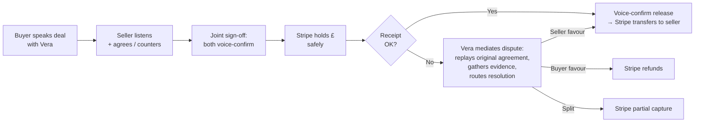

# Vouch

> **Voice-recorded payment protection.** Vera - an AI mediator - captures the deal in both parties' voices. Stripe holds the money safely until the item arrives.

[](https://nextjs.org)
[](https://elevenlabs.io)
[](https://stripe.com)
[](LICENSE)

Submitted to [ElevenHacks 2026 Hack #9: Stripe](https://hacks.elevenlabs.io/hackathons/8) · 15–21 May 2026.

**Live:** [vouch.fund](https://vouch.fund) · **Chrome extension:** [vouch.fund/install](https://vouch.fund/install) · **How it works:** [vouch.fund/how-it-works](https://vouch.fund/how-it-works)

---

## What it is

Selling a £400 phone to a stranger on Facebook Marketplace. Hiring a freelancer who might ghost on the invoice. Vouch holds the buyer's money safely while Vera captures the agreement in both parties' voices.

When a deal goes wrong, Vouch doesn't arbitrate from text trails. Vera replays the seller's actual recorded commitment — *"Marcus said: no scratches, original box."* — and the system resolves from voice evidence, not he-said / she-said.

**Two ICPs:** high-value P2P sellers (phones, watches, used Macs) and freelancers (designers, devs, copywriters who've been ghosted on the invoice).

---

## How it works



Every state transition (`DRAFT → AWAITING_SELLER → AGREED → MONEY_HELD → RELEASED`) is server-side guarded. Disputed deals freeze the money until resolution.

---

## Integrations

**ElevenLabs (6 APIs):** ConvAI · Voice Library · v3 Conversational · Scribe v2 Realtime · Multilingual TTS · Sound Generation.

**Stripe (7 primitives):** Connect Express · PaymentIntents (manual capture) · Application Fees · Issuing · Issuing realtime authorization · Webhooks · Agent Toolkit.

Each integration corresponds to a structural part of the flow. Detail per surface: [INTEGRATIONS.md](INTEGRATIONS.md).

---

## Architecture

Next.js 16 App Router. `app/` for routes (buyer intake, seller flow, joint sign-off, dispute, onboard, deal detail, demo). `lib/` for Stripe + ElevenLabs adapters. `types/` for Zod schemas. `docs/` for the design system + agent specs.

Detail: [ARCHITECTURE.md](ARCHITECTURE.md).

---

## Security

Webhook signature verification, server-side state-machine guards on every money-movement endpoint, sanitised Stripe errors, no secrets in the client, status-gated Connect onboarding.

Detail: [SECURITY.md](SECURITY.md).

---

## Run locally

```bash
git clone https://github.com/cheung-scott/vouch.git
cd vouch
pnpm install
cp .env.example .env.local        # fill in Stripe + ElevenLabs keys
pnpm dev
```

Build:
```bash
pnpm build  # next build --webpack
```

Required env vars are documented in [`.env.example`](.env.example). Stripe test mode + ElevenLabs free tier are sufficient for the full flow.

---

## What's next

Roadmap (validation, regulatory partner, AuthN, KV persistence, real LLM extraction, signed-URL voice storage, rate limiting, pen test): [ROADMAP.md](ROADMAP.md).

---

## License

MIT — see [`LICENSE`](LICENSE).

---

*Built solo for [ElevenHacks 2026 Hack #9: Stripe](https://hacks.elevenlabs.io/hackathons/8)
