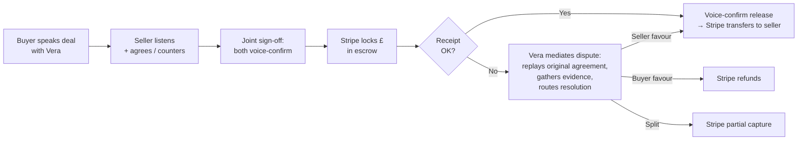

# Vouch

> **The handshake, recorded.** Voice-recorded escrow for freelancers and high-value peer-to-peer sales. Stripe holds the money. Vera, the AI mediator, captures the agreement as a voice. **The evidence is the seller's own voice committing.** 5% per deal.

[](https://nextjs.org)
[](https://elevenlabs.io)
[](https://stripe.com)
[](LICENSE)

Submitted to [ElevenHacks 2026 Hack #9: Stripe](https://hacks.elevenlabs.io/hackathons/8) (15–21 May 2026).

**Try it:** [vouch.app/demo](https://vouch.app/demo) (3-min interactive walkthrough, no signup) · [vouch.app](https://vouch.app) (live product, requires Stripe test card)

---

## What Vouch is

Selling something valuable to a stranger on Facebook Marketplace? Hiring a freelancer who might ghost on the invoice? Vouch holds the money in escrow with Stripe, and Vera — our voice-first AI mediator — captures the agreement on both sides. **Every commitment is a voice recording. The contract is your handshake, on the record.**

That last point is the whole pitch. Existing peer-to-peer platforms arbitrate disputes from text trails: he said / she said over Messenger. Vouch arbitrates from voice recordings. When something arrives broken, Vera replays the original commitment in the seller's own voice — *"Marcus said: no scratches, original box."* The seller cannot un-say it. The evidence is the promise.

### Two ICPs

- **High-value P2P sellers** — phones, watches, used MacBooks, designer goods. Anyone who's been burned by "Venmo and pray."
- **Freelancers** — designers, developers, copywriters who've delivered work and been ghosted on the invoice. Vouch holds the client's payment before the work ships.

---

## How it works



The state machine is enforced server-side. Every transition (`DRAFT → AWAITING_SELLER → AGREED → IN_ESCROW → RELEASED`) is guarded against out-of-order calls. Disputed deals freeze the money until resolution.

---

## Why we built it the way we did

### Multi-API depth — ElevenLabs (5 APIs, all structurally required)

| API | Role |
|---|---|
| **ConvAI** | Vera live as the mediator — sequential sessions for buyer onboarding, seller onboarding, joint sign-off, voice receipt, and dispute |
| **Voice Library** | Vera's locked voice identity — a single brand voice across product + demo video, used by both ConvAI streaming and pre-rendered TTS |
| **TTS** (`eleven_turbo_v2_5`) | Pre-rendered contract recitations (read-back, replay-agreement) — uses a separate voice-settings preset tuned for formal legal-recitation cadence |
| **Scribe** | Transcript-as-contract — the seller's voice is transcribed in real time and the text becomes the legally-binding terms record |
| **Multilingual TTS** (`eleven_v3`) | Cross-border deals — UK buyer, Polish seller. Vera reads buyer's terms in the seller's native language; the in-flight letter-by-letter language morph is the demo video's hero animation |

None of these are decorative. Each one corresponds to a structural part of the product. Remove any and a flow breaks.

### Multi-primitive depth — Stripe (5 primitives, all structurally required)

| Primitive | Role |
|---|---|
| **Connect Express** | Custodial escrow — Vouch is the platform, sellers are the connected accounts. Buyer pays platform → platform holds → platform transfers to seller on release |
| **Identity** | Hosted KYC + selfie verification for both parties before money is locked |
| **PaymentIntents (manual capture)** | The escrow mechanic itself — authorize the buyer's card, hold the amount, capture (release) or cancel (refund) on resolution |
| **Application fees** | The 5% platform fee, collected at capture time |
| **Webhooks** | Signature-verified event handling for the entire lifecycle (`payment_intent.*`, `identity.verification_session.*`, `charge.dispute.*`, `account.updated`, `transfer.*`) |

### Hybrid aesthetic — Stripe × A24 (marketing) + Mercury × Linear (app)

Two surface modes, one identity. Marketing pages are full-bleed black with oversized italic serif and Stripe purple CTA. App pages are cream paper, Mercury indigo accent, Linear-density tables, tabular numerals on every money figure.

Full spec: [`docs/DESIGN.md`](docs/DESIGN.md). HTML mockups: [`docs/reference-html-mockups/`](docs/reference-html-mockups/).

---

## Architecture

```
app/
  page.tsx                       # Marketing landing (Stripe × A24)
  layout.tsx, globals.css        # Design tokens from docs/DESIGN.md
  onboard/                       # Day 1 harness: Stripe Connect + Identity onboarding
  new/                           # Buyer voice intake (5 questions → typed terms)
  demo/                          # Interactive 3-min walkthrough (no signup, no real Stripe)
  deals/                         # Dashboard — list view
  deal/[ref]/                    # Detail + timeline + status-aware action panel
    seller/                      # Seller invitation flow
    signoff/                     # Joint sign-off → lock escrow → confirm receipt
    dispute/                     # Dispute intake + replay + evidence
  api/
    deals/                       # Deal CRUD (GET gated by OWNER_TOKEN in prod)
    connect/                     # Stripe Connect Express + onboarding links
    identity/                    # Stripe Identity verification sessions
    escrow/                      # PaymentIntent create / capture / cancel
                                 # (all guarded: deal_id + PI ownership + status check)
    stripe/webhook/              # Signature-verified Stripe webhook
    vera/                        # 12 ConvAI tool endpoints — see docs/vera-tools.json
components/
  Waveform.tsx, VeraIndicator.tsx, AmbientAudio.tsx, CommandBar.tsx
  ui/                            # Shared design primitives (Card, StatusPill, Eyebrow, MoneyAmount)
lib/
  stripe.ts                      # Connect / Identity / escrow helpers + sanitizeStripeError
  elevenlabs.ts                  # ConvAI + TTS + Scribe + Voice Design wrappers
  deals.ts                       # Deal store (in-memory now, Vercel KV swap-in ready)
  vera-contract.ts               # Pure-string composers for Vera recitations
  vera-extract.ts                # Naive regex utterance parser (LLM swap-in pending)
  utils.ts                       # cn(), formatMoney(), dealReference()
types/
  deal.ts                        # Zod schemas: Currency, Deal, Party, Terms, Dispute
  vera.ts                        # Zod schemas for all 12 Vera tool I/O shapes
docs/
  DESIGN.md                      # Design system spec — source of truth
  VERA-SYSTEM-PROMPT.md          # ConvAI agent configuration
  vera-tools.json                # 12 ConvAI tool descriptors (paste into elevenlabs.io)
  reference-html-mockups/        # Original handcrafted mockups
```

---

## Security posture

Vouch handles money movement, PII, and identity documents. We treat that seriously: every locked development seam runs **forensic + security review in parallel**, and the codebase you're looking at has been adversarially audited before shipping.

What that means concretely:

- **Money-movement endpoints** verify deal-ID + PaymentIntent ownership match + state-machine status guard on every Stripe-touching route. An anonymous caller with a PI ID alone cannot capture or cancel an escrow.
- **Webhook handlers** verify Stripe signatures against the raw request body (not the parsed JSON) and route 3DS `requires_action` + async `processing` events alongside the happy path.
- **API response shapes are curated**, not blanket-serialised — `GET /api/deals/[id]` returns only what the UI needs. Emails, phone numbers, and Stripe identifiers stay server-side.
- **Stripe SDK errors are sanitised** before reaching clients — no key-mode hints, no account hints, no rate-limit reconnaissance signal. Full errors go to server logs only.
- **State-machine guards** are applied symmetrically across paired transitions (e.g. `commit-buyer-side` and `commit-seller-side`). A deal in `IN_ESCROW` cannot be regressed to an earlier state.
- **No secrets bundled into the client** — `APP_URL` is server-only, not `NEXT_PUBLIC_*`.
- **Open-redirect closed** on Connect Express refresh links (account IDs are validated against a known seller list).

Hackathon scope explicitly does NOT include session-based AuthN, rate limiting, or signed URLs for voice biometric data — these are roadmap items, each documented with the specific failure mode they close. The codebase is hackathon-safe (every CRITICAL finding from the audits was remediated); production-readiness adds those three layers plus a third-party penetration test.

Full audit trail and remediation history: see the off-plan log in `Obsidian_Vault/Projects/Vouch/OffPlanLog.md` (post-mortem study artifact).

---

## Getting started

```bash
# Clone
git clone https://github.com/cheung-scott/vouch.git
cd vouch

# Install
pnpm install

# Configure environment
cp .env.example .env.local
# Edit .env.local — see "Required environment variables" below

# Run
pnpm dev
```

Build uses `webpack` not Turbopack (pnpm-on-Windows root-detection issue with Turbopack):

```bash
pnpm build  # next build --webpack
```

### Required environment variables

```
STRIPE_SECRET_KEY=sk_test_...
NEXT_PUBLIC_STRIPE_PUBLISHABLE_KEY=pk_test_...
STRIPE_WEBHOOK_SECRET=whsec_...
STRIPE_CONNECT_CLIENT_ID=ca_...
ELEVENLABS_API_KEY=...
ELEVENLABS_VERA_AGENT_ID=agent_...
ELEVENLABS_VERA_VOICE_ID=voice_...
APP_URL=http://localhost:3000        # Server-side only, NOT NEXT_PUBLIC_
OWNER_TOKEN=                         # Optional, gates GET /api/deals in prod
```

The full set (with comments) is in [`.env.example`](.env.example).

### Try the demo route

The `/demo` route runs a 3-minute scripted walkthrough against an in-memory deal store. No Stripe keys required, no Connect onboarding friction. You play both buyer and seller, hear Vera mediate in two languages, and walk through a dispute resolution scenario. The screen recording from `/demo` is also the source video for the submission's 75-second demo film.

---

## What's deferred post-hackathon

For a real, live-money deployment of this product, in order:

1. **Product validation** (~1 month) — 20 user interviews. Freelancers + P2P sellers. Validates we built the right thing.
2. **Legal / regulatory** — UK FCA authorisation OR partner with a regulated escrow provider (Mercury, Modern Treasury, Stripe Treasury). Money-handling is regulated; can't skip this.
3. **Auth layer** — session-based at minimum. Cookie-pinned deal ownership. Magic-link login for return visits.
4. **Real LLM extraction** — swap `lib/vera-extract.ts` regex for Claude. Same interface.
5. **Vercel KV persistence** — swap `lib/deals.ts` in-memory store. Same `DealStore` interface.
6. **Voice recording storage** — signed URLs only; biometric data under GDPR Article 9.
7. **Rate limiting** — Vercel Edge middleware on `/api/identity/create-session` first (per-call Stripe billing cost), then everything else.
8. **Paid penetration test** — first external security investment. ~$8-15k from a reputable firm.
9. **SOC 2** — post-revenue. Required by enterprise customers.

---

## License

MIT — see [`LICENSE`](LICENSE).

---

*Built for [ElevenHacks 2026 Hack #9: Stripe](https://hacks.elevenlabs.io/hackathons/8) by [Scott Cheung](https://github.com/cheung-scott).*
