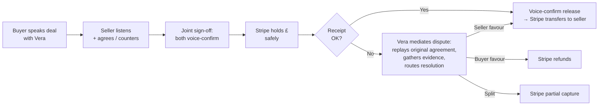

# Vouch

> **Voice-recorded payment protection.** Vera — an AI mediator — captures the deal in both parties' voices. Stripe holds the money safely until the item arrives, then releases it on voice-confirmed receipt.

**[Try it live at vouch.fund](https://vouch.fund)** · [Chrome extension](https://vouch.fund/install) · [How it works](https://vouch.fund/how-it-works) · Submitted to [ElevenHacks Hack #9: Stripe](https://hacks.elevenlabs.io/hackathons/8) (May 15–21 2026)

---

## The pitch

Selling a £400 phone to a stranger on Facebook Marketplace. Hiring a freelancer who might ghost on the invoice. Vouch holds the buyer's money safely while Vera captures the agreement in both parties' voices — then releases it on voice-confirmed receipt, so the seller actually gets paid on time.

When a deal goes wrong, Vouch doesn't arbitrate from text trails. Vera replays the seller's actual recorded commitment — *"Marcus said: no scratches, original box"* — and the system resolves from voice evidence, not he-said / she-said.

**Two ICPs:** high-value P2P sellers (phones, watches, used Macs) and freelancers (designers, devs, copywriters who've been ghosted on the invoice).

## How it works



Every state transition (`DRAFT → AWAITING_SELLER → AGREED → MONEY_HELD → RELEASED`) is server-side guarded. Disputed deals freeze the money until resolution.

## Vera as agent

Vera isn't a chatbot tied to a single transcript. She's the same voice identity across five sequential ConvAI sessions — buyer intake, seller acceptance, joint sign-off, voice-confirmed receipt, and dispute mediation — each with its own system prompt and tool surface but the same Samara X voice from the ElevenLabs Voice Library, so the user experiences one continuous mediator across the deal's lifecycle.

Twelve server-side tools back her: deal lookup, term extraction, lock-money, release-money, refund, dispute-open, evidence-attach, and so on. The voice IS the binding record — Scribe v2 Realtime transcribes every commitment to immutable text the moment it leaves the speaker's mouth, and the resolution layer replays the original audio when a deal goes sideways.

For cross-border deals, Vera reads the buyer's terms in the seller's native language via Multilingual TTS — the in-flight letter-by-letter language morph is the demo's hero animation.

## Money flow

Vouch sits on Stripe Connect Express as the platform; sellers are connected accounts. The hold mechanic is PaymentIntents with manual capture: authorise the buyer's card, hold the amount, capture (release) or cancel (refund) on resolution. Application Fees retain a flat 2.9% at capture — zero markup on Stripe's processing rate.

When money locks, Vouch mints a frozen Stripe Issuing virtual card sized to the held amount. Voice-confirmed receipt activates it. Stripe's realtime `issuing_authorization.request` webhook hits a dedicated hot-path endpoint that compares each spend against the deal's agreed merchant category and responds within the 2-second decision window — Vera doesn't just hold the money, she gatekeeps how it gets spent. This inverts the usual agentic-commerce pattern: instead of the agent paying with a card, Vera mints one *for* the seller.

The Stripe webhook handler is the async source of truth: signature-verified against the raw body, multi-secret for platform vs connected-account scopes, KV-backed idempotency with a 4-day TTL on `event.id`.

## Stack

- **[Next.js 16](https://nextjs.org)** App Router · TypeScript · Tailwind 4 · Vercel
- **[ElevenLabs](https://elevenlabs.io)** — ConvAI (Vera's 5 sessions, 12 server-side tools), Voice Library (Samara X — locked brand voice), v3 Conversational (expressive audio tags at money-movement beats), Scribe v2 Realtime (voice → binding terms record), Multilingual TTS (cross-border letter-by-letter morph), Sound Generation (lock-thunk, release-bell, dispute-chime)
- **[Stripe](https://stripe.com)** — Connect Express (custodial), PaymentIntents manual capture (the hold), Application Fees (2.9% platform fee), Issuing (frozen virtual card per deal), Issuing realtime auth (sub-2s decision endpoint), Webhooks (state machine source of truth), [Agent Toolkit](https://github.com/stripe/agent-toolkit) (restricted-key blast-radius enforcement)
- **Chrome extension** (manifest v3) — injects "Pay with Vouch" on eBay listings · [install instructions](https://vouch.fund/install)
- **Vercel KV** — production persistence (in-memory fallback for local dev)

## Run it locally

```bash
pnpm install
cp .env.example .env.local   # fill in Stripe + ElevenLabs keys
pnpm dev                      # → http://localhost:3000
pnpm build                    # next build --webpack
```

Stripe test mode + ElevenLabs free tier are sufficient for the full flow.

## License

MIT — see [LICENSE](LICENSE).
